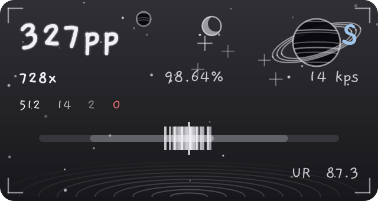
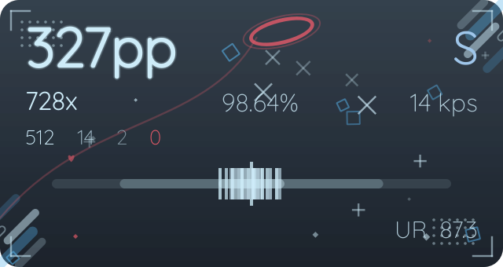
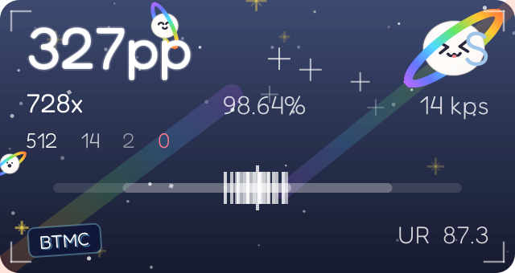
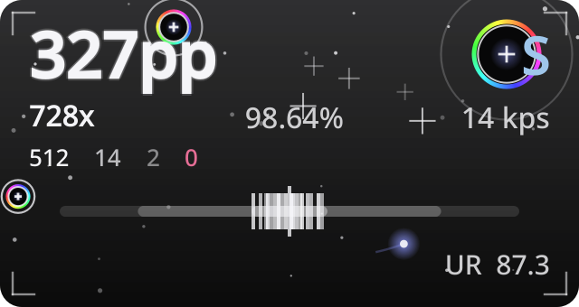

# PPeek

**Live PP overlay for [osu!lazer](https://osu.ppy.sh) — hit-error meter, UR, combo, accuracy and KPS, with skin-driven themes. Windows & Linux.**

<p align="center">
  
  &nbsp;&nbsp;
  
</p>
<p align="center">
  
  &nbsp;&nbsp;
  
</p>

<p align="center">
  <em>The overlay re-themes itself to match the skin you're playing —<br>
  FOOL MOON NIGHT ink, Arona &amp; Plana (Blue Archive) pastel,<br>
  FREEDOM DiVE REiMAGINED cosmic, and clearBlack.</em>
</p>

---

## ✨ Features

- **Live PP**, combo, accuracy, grade and hit counts — streamed from [tosu](https://tosu.app) over its local WebSocket, no osu! plugins needed
- **Hit-error meter** with fading tick marks and 300/100/50 windows, plus **UR (unstable rate)** readout
- **KPS counter** — evdev on Linux, tosu keyOverlay counters on Windows
- **Click-through & focus-free** — the overlay never steals input from the game
- **Auto-hide**: appears when a beatmap starts, disappears after it ends
- **Tray status icon**: gray = waiting for osu!, amber = attaching tosu, green = running
- **tosu is managed for you** — the app starts and restarts tosu automatically, no manual setup

### 🎨 Skin-driven themes
The overlay reads the **active skin name from osu!lazer** (via tosu) and switches its entire look on the fly:

| Skin | Theme |
|---|---|
| FOOL MOON NIGHT | Hand-drawn monochrome ink: hatched planets, crescent moon, twinkling stars, water ripples, Gaegu font |
| Arona & Plana (HK7205A) | Blue Archive pastel: red halo with its trailing string, stripe clusters, drifting diamonds, Readex Pro font — colors sampled from the skin's own `skin.ini` |
| FREEDOM DiVE REiMAGINED | Cosmic blue: blob planets with rainbow rings, shooting-star arrows, diamond confetti, golden sparkles, the skin's BTMC tag, Fredoka font |
| clearBlack | True black with rainbow-ring crosshair hitcircles looping their approach circles, drifting blue-violet cursor glow |
| anything else | Falls back to the ink theme |

Everything is painted procedurally — no image assets, just code. Adding a theme for your skin is a single palette entry in [`ppeek/overlay/theme.py`](ppeek/overlay/theme.py).

**Prefer picking by hand?** The Settings → Skins tab shows live previews of every theme — the four skin tributes plus six classic color palettes (**Gruvbox, Everforest, Nord, Tokyo Night, Catppuccin, Ayu**) — with an *apply* button on each card. Applying overrides the skin matching until you switch back to *Auto (match my skin)*; the running overlay swaps live.

## 🚀 Getting started

### Windows 10 / 11

1. Download `PPeek-windows.zip` from the [latest release](../../releases/latest)
2. Unzip anywhere and run `PPeek.exe` (tosu is bundled and started automatically)
3. Start osu!lazer in **borderless / windowed fullscreen** — no overlay software can draw over exclusive fullscreen
4. The tray icon turns green when everything is attached; the overlay appears when you start a beatmap

### Arch Linux
```sh
git clone https://github.com/cavalinho-xdd/ppeek.git
cd ppeek
makepkg -si
```

On Wayland with `layer-shell-qt` the overlay renders on the wlr-layer-shell overlay layer (visible above fullscreen games); X11 falls back to a frameless always-on-top window.

### Anywhere else
```sh
pip install .
ppeek
```

## 🧩 How it works

```
osu!lazer ──▶ tosu ──▶ WebSocket (localhost:24050) ──▶ telemetry listener
                                                          │
     evdev (Linux) / keyOverlay ──▶ KPS + UR fallback ────┤
                                                          ▼
                                       Qt overlay (layer-shell / widget)
                                                 theme ⇆ active skin
```

- Single asyncio loop inside the Qt main loop (qasync) — no threads
- A supervisor keeps tosu freshly attached: whenever osu! restarts, tosu is restarted too
- Telemetry UR wins; evdev rhythm-stability UR only fills the gaps

## 🗺️ Roadmap

- [x] Windows port
- [x] More themes (six color-palette themes + manual apply)
- [ ] Theme editor

## 🙏 Credits

The overlay themes are original, procedurally painted tributes — colors are sampled from each skin's `skin.ini` or matched by eye, and **no skin assets are copied or redistributed**. The skins remain the work and property of their authors — go grab them (the in-app **Skins** tab shows live previews and links straight to these pages):

| Skin | Author | Download |
|---|---|---|
| FOOL MOON NIGHT | Spoo | [skins.osuck.net/skins/2931](https://skins.osuck.net/skins/2931) |
| FREEDOM DiVE REiMAGINED | Spoo | [skins.osuck.net/skins/4062](https://skins.osuck.net/skins/4062) |
| Blue Archive — Arona & Plana | Kitazaki Hinata | [skins.osuck.net/skins/4434](https://skins.osuck.net/skins/4434) |
| clear black | FakeCarpetGrass | [skins.osuck.net/skins/308](https://skins.osuck.net/skins/308) |

- FREEDOM DiVE REiMAGINED is a tribute to **[BTMC](https://www.twitch.tv/btmc)** — former top-tier osu! player and now host of the osu! Roundtable tournaments. The overlay's freedom theme carries the skin's BTMC tag in homage.
- Live game data is provided by **[tosu](https://tosu.app)** (bundled and auto-managed on Windows).
- **osu!** is a trademark of [ppy Pty Ltd](https://ppy.sh). This is an unofficial fan project, not affiliated with or endorsed by ppy, tosu, BTMC, or the skin authors.

## 📄 License

MIT. Bundled fonts ([Gaegu](https://fonts.google.com/specimen/Gaegu), [Readex Pro](https://fonts.google.com/specimen/Readex+Pro), [Fredoka](https://fonts.google.com/specimen/Fredoka), [Quicksand](https://fonts.google.com/specimen/Quicksand), [Mochiy Pop One](https://fonts.google.com/specimen/Mochiy+Pop+One)) are licensed under the SIL Open Font License.
